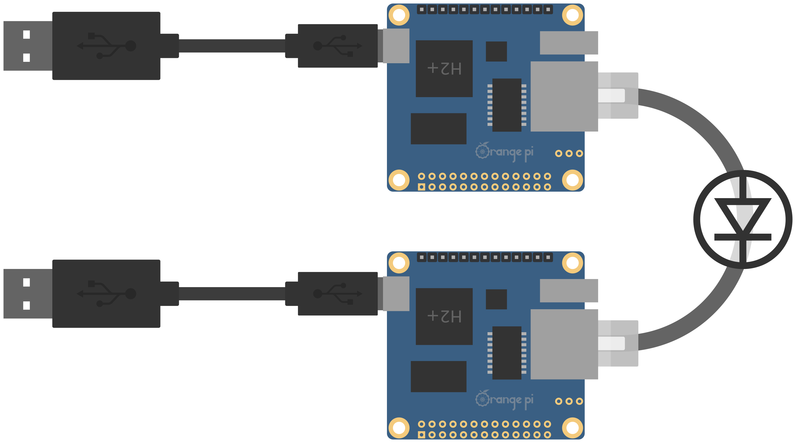

# Basic and Inexpensive Network Diode (BIND)

## Basic principle

Transmit data one way.

Difficulties:

  * Impossible to detect loss of transmission
  * Very few protocol and technologies dedicated to this use case

Thougt it is possible to do the same with a software or hardware firewall, the idea here is to create a electronic isolation that is more difficult to bypass and less subject to human error.

## Some ideas

### The physical diode

Fast ethernet networks use two copper pair to communicate : one pair for each way. It is easy to trick the network by disconnecting the receiving pair on one side so the transmission can only occur in one way. The receiver gateway is not aware that the data it send is lost.

There is still a problem : the emmiter gateway never recieves data so it's ethernet port remains innactive thinking no cable is actualy pluged. In order to force the activation of the port it is possible to "plug it on itself" by wirering the emmiting pair on the receiving pair. That will create an echo and the port will go up because it will sense it's own NLP signals.

Note this will not work on gigabit networks.

### USB and Ethernet

Two ethernet ports would be needed on the emmiter and the receiver gateway to relay the data. Sadly, most SoC only have one onboard.

Ethernet over USB is a good alternative. Performance is not as great than on a dedicated ethernet port especialy regarding latency. In this usecase, latency is not an issue and neither is bandwith because the diode is only 100 Mbps.

USB also has an interesting feature by providing the board with both data and electric power. This setup does not require an extra power supply.

### Pseudo synchronous transfert

Similar projects use a store and forward approach were files are recusively store and transmitted from one link to the next in the transmision chain. This approach implies the transfered files been fully stored on both gateways at some point. It meens the storage has to be sized appropriately and always available for writing.

Another approch is to transmit data as a continuous stream. This way the files can be transmited to the next hop without been fully loaded in the first place. The major drawback is induce by the synchronus nature of this transmition. The stream has to be stable and carefully adjusted.

## Prototype

