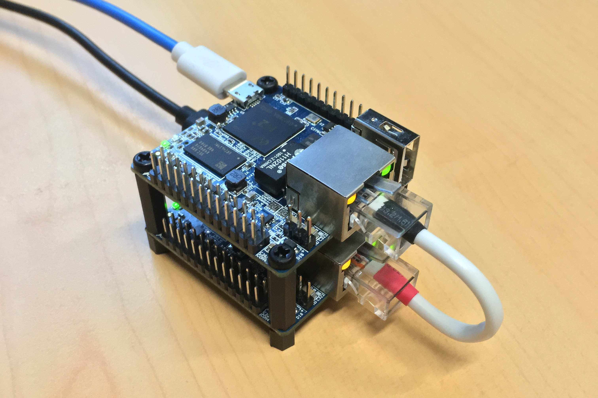

# Basic and Inexpensive Network Diode (BIND)

## Basic principle

Transmit data one way.

Challenges:

  * Impossible to detect loss of transmission
  * Very few protocol and technologies dedicated to this use-case

Thought it is possible to do the same with a software or hardware firewall, the idea here is to create a electronic isolation that is more difficult to bypass and less subject to human error.

## Some ideas

### The physical break

Fast Ethernet networks use two copper pair to communicate : one pair for each way. It is easy to trick the network by disconnecting the receiving copper pair on one side so the transmission can only occur in one way. The receiver gateway is not aware that the data it send is lost.

There is still a problem : the emitter gateway never receives data so it's Ethernet port remains inactive thinking no cable is actually plugged. In order to force the activation of the port it is possible to "plug it on itself" by wiring the emitting pair on the receiving copper pair. That will create an echo and the port will go up because it will sense it's own NLP signals.

Note this will not work on gigabit networks.

### USB and Ethernet

Two Ethernet ports would be needed on the emitter and the receiver gateway to relay the data. Sadly, most SoC only have one on-board.

Ethernet over USB is a good alternative. Performance is not as great than on a dedicated Ethernet port especially regarding latency. In this use-case, latency is not an issue and neither is bandwidth because the diode is only 100 Mbps.

USB also has an interesting feature by providing the board with both data and electric power. This setup does not require an extra power supply.

### Pseudo synchronous transfer

Similar projects use a store and forward approach were files are recursively store and transmitted from one link to the next in the transmission chain. This approach implies the transfered files been fully stored on both gateways at some point. It means the storage has to be sized appropriately and always available for writing.

Another approach is to transmit data as a continuous stream. This way the files can be transmitted to the next hop without been fully loaded in the first place. The major drawback is induce by the synchronous nature of this transmission. The stream has to be stable and carefully adjusted.

## Prototype

Two [Orange PI zero](http://www.orangepi.org/orangepizero/) development boards with the following benefits:

  * Low footprint
  * Low cost (around 15€ for the 512MB of RAM at the end of 2017)
  * Low power consumption allowing USB only powering
  * Ethernet port (managed by the SoC)

